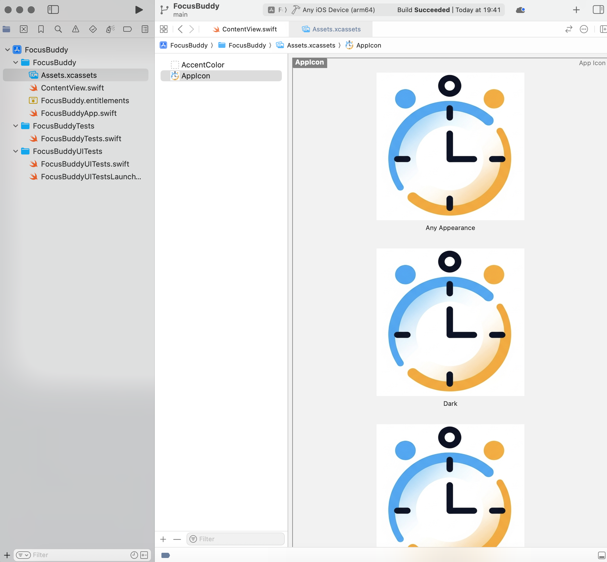

# FocusBuddy

**FocusBuddy** es una aplicación de temporizador Pomodoro diseñada especialmente para personas con TDAH o para cualquier persona que necesite mejorar su enfoque y productividad.

### ✅ Funcionalidades
- Temporizador de 25 minutos tipo Pomodoro.
- Botón de iniciar/detener.
- Barra de progreso circular animada y colorida.
- Interfaz limpia y minimalista usando SwiftUI.

### 🚀 Instalación Local (Desarrolladores)

1. Clonar el repositorio:
   ```bash
   git clone git@github.com:Daverosales93/FocusBuddy.git
   ```
2. Abrir el proyecto en Xcode.
3. Ejecutar en un simulador o dispositivo real (requiere cuenta de desarrollador de Apple).

### 🎨 Capturas de Pantalla
*(Agrega aquí capturas de la app si las tienes.)*

### 📦 Tecnologías Utilizadas
- Swift 5
- SwiftUI
- Xcode 15+

### 🛠️ Contribuciones
Pull requests y sugerencias son bienvenidas. Para cambios importantes, por favor abre un issue primero para discutir lo que te gustaría cambiar.

### 📄 Licencia
MIT License

---

Desarrollado con 💙 por [David Rosales Álvarez](https://github.com/Daverosales93).

# FocusBuddy

**FocusBuddy** is a Pomodoro timer application designed specifically for people with ADHD or anyone looking to improve focus and productivity.

### ✅ Features
- 25-minute Pomodoro timer.
- Start/Stop button.
- Animated circular progress bar with colorful gradient.
- Clean and minimalist interface using SwiftUI.

### 🚀 Local Installation (Developers)

1. Clone the repository:
   ```bash
   git clone git@github.com:Daverosales93/FocusBuddy.git
   ```
2. Open the project in Xcode.
3. Run on a simulator or real device (requires an Apple Developer account).

### 🎨 Screenshots
*(Add screenshots of the app here if available.)*

### 📦 Technologies Used
- Swift 5
- SwiftUI
- Xcode 15+

### 🛠️ Contributions
Pull requests and suggestions are welcome. For major changes, please open an issue first to discuss what you'd like to change.

### 📄 License
MIT License

### 🎨 Screenshots



---

Developed with 💙 by [David Rosales Álvarez](https://github.com/Daverosales93).